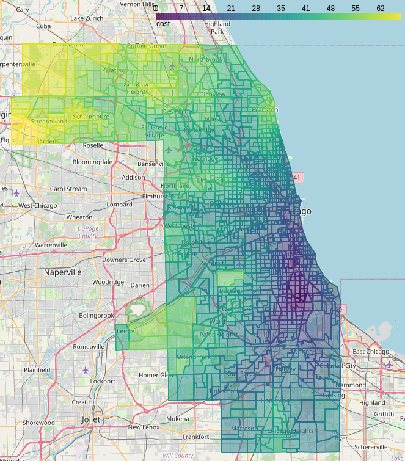

# Pysal Access Compute Example

[View the notebook on CyberGISX Hub](https://cybergisxhub.cigi.illinois.edu/notebook/pysal-access-compute-example/).

**Authors:** Alexander Michels, Taylor Ziegler, Zimo Xiao, Mit Kotak, Anand Padmanabhan, Zhiyu Li, and Shaowen Wang

This notebook walks through a relatively simple application for [CyberGIS-Compute](https://cybergis.github.io/cybergis-compute-python-sdk/): calculating accessibility to doctors in Chicago, Illinois, U.S. using the [Pysal Access package](https://pysal.org/access/index.html). We will then download the results and calculate correlations between the metrics. It also serves to explain what a CyberGIS-Compute model looks like and how one could contribute models of their own.

The [RunAccessJob.ipynb notebook](RunAccessJob.ipynb) walks you through:

* **What is Spatial Accessibility:** We quickly give an explanation of the analysis we will be conducting.
* **Data Exploration:** A quick exploration of the data used in our analysis.
* **Access with CyberGIS-Compute:** Run accessibility analysis using CyberGIS-Compute.
* **Analyzing the Outputs:** Retrieve our results from the HPC and analyze the results.
* **Contributing Your Model:** Learn a bit about how someone can contribute their own model.
* **Learn More about CyberGIS-Compute:** Provides some resources for those interested in learning more about CyberGIS-Compute.